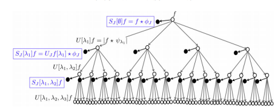

# Summary

The Wavelet Scattering transform is an (invariant, ..., what it does).
Developed by Mallat, etc.
Bruna et al interpreted the WST cascade as equivalent to the convolutional 
portion of a convolutional neural network.
Blusky is an implementation of the 1 and 2D WST as a CNN using Tensorflow and Keras.
It is designed to be flexible to adapt to different problems
Parameters have clear physical purpose
Features for analysis of texture and machine learning tasks

# Statement of need

Existing implementations of the WST are provided for Matlab or adapted to Python.
`ScatNet` [@scatnet]
`kymatio`
`blusky` was designed to provide a unified library that is accessible to general purpose research and industrial applications of the WST.
Implementation using Tensorflow allows the GPUs to be used for computation, speeding results.

`Gala` is an Astropy-affiliated Python package for galactic dynamics. Python
enables wrapping low-level languages (e.g., C) for speed without losing
flexibility or ease-of-use in the user-interface. The API for `Gala` was
designed to provide a class-based and user-friendly interface to fast (C or
Cython-optimized) implementations of common operations such as gravitational
potential and force evaluation, orbit integration, dynamical transformations,
and chaos indicators for nonlinear dynamics. `Gala` also relies heavily on and
interfaces well with the implementations of physical units and astronomical
coordinate systems in the `Astropy` package [@astropy] (`astropy.units` and
`astropy.coordinates`).

`Gala` was designed to be used by both astronomical researchers and by
students in courses on gravitational dynamics or astronomy. It has already been
used in a number of scientific publications [@Pearson:2017] and has also been
used in graduate courses on Galactic dynamics to, e.g., provide interactive
visualizations of textbook material [@Binney:2008]. The combination of speed,
design, and s

upport for Astropy functionality in `Gala` will enable exciting
scientific explorations of forthcoming data releases from the *Gaia* mission
[@gaia] by students and experts alike.

# Applications
Any papers from Mike?
Any work we've done with this?

# Mathematics

Single dollars ($) are required for inline mathematics e.g. $f(x) = e^{\pi/x}$

Double dollars make self-standing equations:

$$\Theta(x) = \left\{\begin{array}{l}
0\textrm{ if } x < 0\cr
1\textrm{ else}
\end{array}\right.$$

You can also use plain \LaTeX for equations
\begin{equation}\label{eq:fourier}
\hat f(\omega) = \int_{-\infty}^{\infty} f(x) e^{i\omega x} dx
\end{equation}
and refer to \autoref{eq:fourier} from text.

# Citations

Citations to entries in paper.bib should be in
[rMarkdown](http://rmarkdown.rstudio.com/authoring_bibliographies_and_citations.html)
format.

If you want to cite a software repository URL (e.g. something on GitHub without a preferred
citation) then you can do it with the example BibTeX entry below for @fidgit.

For a quick reference, the following citation commands can be used:
- `@author:2001`  ->  "Author et al. (2001)"
- `[@author:2001]` -> "(Author et al., 2001)"
- `[@author1:2001; @author2:2001]` -> "(Author1 et al., 2001; Author2 et al., 2002)"

# Figures

Figures can be included like this:

and referenced from text using \autoref{fig:example}.

# Acknowledgements

We acknowledge the support of Sandia National Labs and Enthought for the development of this project.

# References